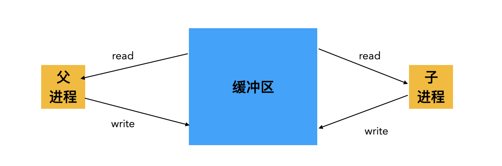

# Lab1 

lab1的任务主要是根据系统调用，实现一些简单的shell命令，偏向于用户层。下面记录一些我做lab的思路和代码。
## 一、sleep
刚开始接触lab时，以为没有给任何前置知识和资料就开始让我们实现sleep内核，于是对着kernel目录下的代码懵逼了许久，但其实这题非常简单，其目的就是让我们熟悉系统调用sleep()的使用。代码贴下面了。

```c
#include<kernel/types.h>
#include<user/user.h>
int 
main(int argc, char* argv[])
{
    if(argc != 2){
	       printf("you must input one argument!\n");
	       exit(1);
    }
    int time = atoi(argv[1]);
    printf("sleep %d s\n",time);
    sleep(time);
    exit(0);
}
    
```
## 二、pingpong
此题的要求是实现父进程与子进程之间的双向消息传输要求父进程向子进程传输数据:子进程按照给定的格式打印数据以及自己的pid;子进程向父进程传输数据，父进程按给定的格式打印数据以及自己的pid
    实现这题，需要了解pipe(),read()和write()函数。关于三个函数的要点如下：
* int pipe(int fd[]) 接收的参数是大小为2的int类型数组
* pipe会创建两个文件描述符，并写入到实参中，fd[0]只能读，fd[1]只能写 (或许可以看成是指向一个缓冲区的两个文件描述符，一个操控读指针，一个操控写指针)
* 管道内实现了阻塞机制，当读进程从fd[0]中读数据时，若缓冲区为空，则改进程会一直等待，直到缓冲区中有数据或者fd[1]的引用计数为0（此时读进程会收到EOF信号，并且不再等待）
    实现进程之间的数据传输可以通过管道实现，一个进程向管道写数据，另一个进程从管道读数据。实现这个需求，需要创建两个管道（示意图如下）
    
    
```c
#include<kernel/types.h>
#include<user/user.h>
#define READ 0
#define WRITE 1
int 
main(int argc, char * argv[]){
    int pipe1[2],pipe2[2];
    pipe(pipe1);pipe(pipe2);
    int buf[1];
    if(fork() == 0){
        close(pipe1[WRITE]);
        close(pipe2[READ]);

        read(pipe1[READ],buf,1);
        printf("%d: received ping\n",getpid());
        write(pipe2[WRITE],"Dad",3);

        close(pipe1[READ]);
        close(pipe2[WRITE]);
    }else{
        close(pipe1[READ]);
        close(pipe2[WRITE]);

        write(pipe1[WRITE],"Son",3);
        read(pipe2[READ],buf,1);
        printf("%d: received pong\n",getpid());
        
        close(pipe1[WRITE]);
        close(pipe2[READ]);
    }
    exit(0);
}
```
## 三、primes
这一题题目有点费解，其要求就是让我们通过多进程并发[](https://swtch.com/~rsc/thread/)的方法打印1-35之间的质数（因为xv6资源关系只需要打印1-35之间的质数）

```c
#include"kernel/types.h"
#include"kernel/stat.h"
#include"user/user.h"

#define READEND 0
#define WRITEEND 1

void loop(int leftFd[2]){
    close(leftFd[WRITEEND]);
    int prime;
    if((read(leftFd[READEND],&prime,sizeof(int))==0)){
        //若leftFd[READEND]引用计数不为0，而缓冲区中没有数据，
        //则read会一直阻塞等待，直到有数据或者EOF标志（leftFd[READEND]引用计数为0）
        close(leftFd[READEND]);
        exit(0);
    } 
    printf("prime %d\n",prime);
    int rightFd[2];
    pipe(rightFd);
    if(fork() == 0){
        close(leftFd[READEND]);
        loop(rightFd);//rightFd中未必有东西
    }else{//父进程
        close(rightFd[READEND]);
        int num;
        //sleep(30);不需要sleep，因为read、wirte已经实现了同步机制，read的那一端会等待这一进程写完数据
        while(1){
            int n = read(leftFd[READEND],&num,sizeof(int));
            if(n == 0){
                break;
            }
            if(num % prime != 0){
                write(rightFd[WRITEEND],&num,sizeof(int));
            }
        }
        close(rightFd[WRITEEND]);
        close(leftFd[READEND]);
        wait((int*)0);
    }
    exit(0);
}


int main(int argc,char* argv[]){
    //通过pipe共享信息
    //父进程写，子进程读
    int fd[2];
    int i;
    pipe(fd);
    if(fork() == 0){
        sleep(20);
        //read（）和write（）可以保证在父进程写入num之后再调用childProcess
        loop(fd);
    }else{
        close(fd[READEND]);
        for(i = 2 ; i < 36 ; i++){
            write(fd[WRITEEND],&i,sizeof(int));
        }
        close(fd[WRITEEND]);
        wait((int*)0); //等待子进程退出，回收子进程残余空间
    }
    exit(0);
}
```
##  四、find
此题让我们实现find功能，find命令接收两个参数，第一个参数是目录，第二个参数文件名，我们需要递归查找该目录下的所有能够匹配文件名的文件名。
这一实验的主要目的是让我们熟悉的结构。

```c 
// "kernel/stat.h" 下
struct stat { 
  int dev;     // File system's disk device
  uint ino;    // Inode number i节点号
  short type;  // Type of file，是目录文件还是普通文件
  short nlink; // Number of links to file,文件引用计数
  uint64 size; // Size of file in bytes
};
```
```c
// "kernel/fs.h" 下
struct dirent { 
  ushort inum;
  char name[DIRSIZ];
};
```
## 五、实现xargs
首先我们先看一些例子(看下图)，xargs到底是干啥的?

command1 arg11，arg12... | xargs command2 arg21,arg22...arg2m
xargs的作用是将|左边命令command1的输出作为|右边的command2的输入参数。-n的作用是控制arg后每一次运行exec从command1的输出中选几个参数拼接到arg2m后。但是这一题不需要实现-n可选项，默认-n为1。
关键思路是，先将command2 arg21...arg2m这一串参数保存在params数组中，然后再一次性从标准输入中读取MAXSIZE长度的数据到buf数组中，遍历buf，依次解析buf中的字符，遇到‘ ’和‘\n'就将目前读取到的字符串记录在params中。
这里需要注意的是
* 遇到‘ ’和‘\n'后，要在字符串末尾加’\0'
* 处理完一行后，要在params末尾加’\0‘ 

```c
#include "kernel/types.h"
#include "user/user.h"
#include "kernel/param.h"
#define MAXSIZE 1024
#define STDIN_FILE 0
#define MAXLEN 32
void run(char * argv[]){
    if(fork() == 0){
        exec(argv[0],argv);
        exit(0);
    }else{
        wait(0);
    }
}

int main(int argc, char* argv[])
{
    // xargs cmd <>
    if(argc < 2){
        printf("please using xargs command <args>\n");
    }
    char buf[MAXSIZE];
    char* params[MAXARG];
    int params_index = 0, arg_index = 0, max_rags = argc - 1;
    int i,read_len;
    for(i = 1 ; i < argc; i++) params[params_index++] = argv[i]; // argv[0] = 'xargs' , argv[1] = cmd, begin with 1,
    
    //在子进程中创建的空间，实际物理地址是和父进程不同的，但是虚拟地址是相同的
    while(1){
        while ( ( read_len = read(STDIN_FILE,buf,sizeof(buf) ) ) > 0 ) // 父进程和子进程都会执行这一步吗？
        {
            arg_index = 0;
            params_index = argc - 1;
            char * arg = (char*) malloc(MAXLEN);
            
            for(i = 0 ; i < read_len; i++){
                if(buf[i] == '\n' || buf[i] == ' '){
                    arg[arg_index] = 0;  
                    arg_index = 0; 
                    params[params_index++] = arg;
                    arg = (char*) malloc(MAXLEN);
                }else{
                    arg[arg_index++] = buf[i];
                }
            }
            
            arg[arg_index] = 0;
            params[params_index] = 0;
            max_rags = params_index > max_rags ? params_index : max_rags;
            run(params);
        }
        if(max_rags == argc - 1){ // 处理 |xargs cmd <arg> 的情况
            run(params);
        }
        if(read_len <= 0){
            break;
        }
    }
    exit(0);
}
```