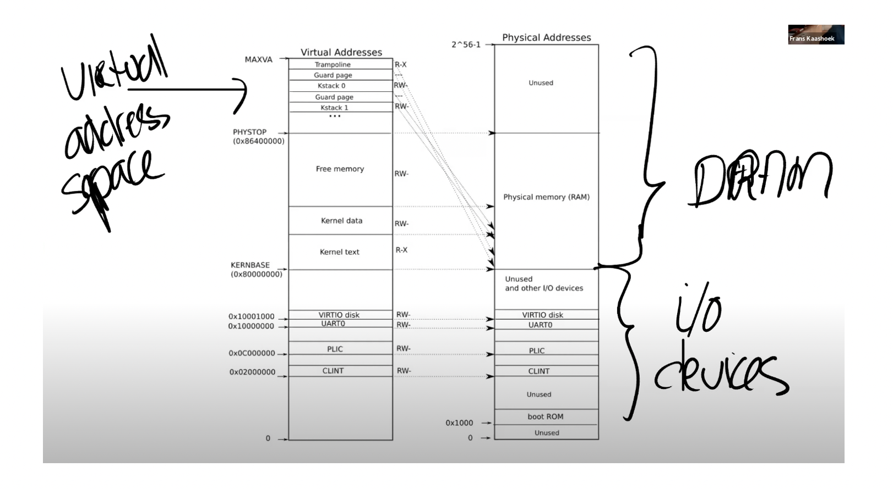
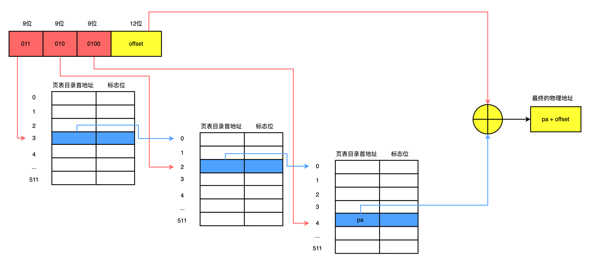

#Lab3
## 一、前言
- 虚地址空间分布

上面这幅图来源于[mit6.S081](https://pdos.csail.mit.edu/6.828/2020/lec/l-vm.txt),左边是虚拟地址，右边是物理地址，其中虚拟地址空间从低地址到高地址分为设备区（0~KERNBASE）,内核空间(KERNBASE~MAXVA)。其中内核空间从下至上，由代码区、数据区、空闲内存区和栈区组成。代码区设置的标志位R-X表示可读可执行但是不可写，数据区的标志位设置为RW-表示只可读可写但是不可运行，因为数据区的数据不能是伪造成指令运行。
栈区的增长方向是从上至下的，并且每申请一个栈区都会附加一个保护页，防止某个栈溢出覆盖了其他栈区的地址。而用户空间分布其实是和内核空间分布是一样的，只不过用户空间中实际的空闲内存边界要远远低于PHYSTOP（在第三个任务中会要求限制用户空间增长的地址边界）。
- 虚拟地址与物理地址之间的映射
从上面的图可以看出是xv6的设备区地址和内核地址是直接映射的。从全局内核页表初始化的代码中也可以直接看出来:

```c
void
kvminit()
{
  kernel_pagetable = (pagetable_t) kalloc();
  memset(kernel_pagetable,0,PGSIZE);
  // kvmmap(uint64 va, uint64 pa, uint64 sz, int perm)的作用是在全局内核页表中增加虚拟地址[va,va+sz)与物理地址[pa,pa+sz)之间的映射，perm是标志位
  // 可以看出下面的映射的虚拟地址和物理地址都是相同的，表明这些地址都是直接映射
  kvmmap(UART0, UART0, PGSIZE, PTE_R | PTE_W);
  // virtio mmio disk interface
  kvmmap(VIRTIO0, VIRTIO0, PGSIZE, PTE_R | PTE_W);

  // CLINT
  kvmmap(CLINT, CLINT, 0x10000, PTE_R | PTE_W);

  // PLIC
  kvmmap(PLIC, PLIC, 0x400000, PTE_R | PTE_W);

  // map kernel text executable and read-only. 设置标志位为 PTE_R | PTE_X表示只读、只可运行
  kvmmap(KERNBASE, KERNBASE, (uint64)etext-KERNBASE, PTE_R | PTE_X);

  // map kernel data and the physical RAM we'll make use of.  设置标注位位 PTE_R | PTE_W表示只读写
  kvmmap((uint64)etext, (uint64)etext, PHYSTOP-(uint64)etext, PTE_R | PTE_W);

  // map the trampoline for trap entry/exit to
  // the highest virtual address in the kernel.
  kvmmap(TRAMPOLINE, (uint64)trampoline, PGSIZE, PTE_R | PTE_X);
}
```
- 页表

在xv6中地址组成为 9+9+9+12,其中9代表着页表目录项占9位，9位二进制数可以表示的地址空间为0~511。12代表页表偏移项占12位。上图为一个逻辑地址转换为物理地址的过程，对应着kernel/vm.c中的函数kvmpa_pagetabel。

```c
uint64
kvmpa_pagetabel(pagetable_t pagetable,uint64 va)
{
  uint64 off = va % PGSIZE;
  pte_t *pte;
  uint64 pa; 
  pte = walk(pagetable, va, 0);
  if(pte == 0)
    panic("kvmpa_pagetabel == 0");
  if((*pte & PTE_V) == 0)
    panic("kvmpa_pagetabel");
  pa = PTE2PA(*pte);
  return pa+off;
}
```
- PTE 与 PA之间的关系

```c
#define PA2PTE(pa) ((((uint64)pa) >> 12) << 10)
#define PTE2PA(pte) (((pte) >> 10) << 12)
    //PA是内存物理地址，PTE是PA右移12再左移10然后再加上标志位,右移12位可以的得到非页  表目录项的物理地址，再左移12位可以得到初始的标志位00 0000 0000。  
``` 

## 二、print page tabel的实现
```c
void dfsPrintPageTable(pagetable_t ptb, int depth){
  for(int i = 0 ; i < 512; i++)
  { // page tabel 里存的是页表项，每一项可能是页的起始虚地址也可能是二级页表的虚地址
    pte_t pte = ptb[i];
    if(pte & PTE_V)
    {
      uint64 child = PTE2PA(pte);
      for(int j = 0 ; j < depth; j++)
      {
        if(j == depth - 1)
        {
          printf("..%d: pte %p pa %p\n",i,pte,child);
        }else
        {
          printf(".. ");
        }
      }
      if((pte & (PTE_R|PTE_W|PTE_X)) == 0)
      {
        dfsPrintPageTable((pagetable_t)child,depth + 1);
      }
    }
  }
}
void vmprint(pagetable_t ptb){
  printf("page table %p\n",ptb);
  dfsPrintPageTable(ptb,1);
}
```
## 三、
对于每个进程都有用户空间和内核空间，在程序中都是使用虚地址。用户空间的虚地址转换至物理地址，需要存储一些映射关系， 而内核空间的虚地址是直接映射到物理地址的。当内核接在syscall中接收到用户传来的指针（用户虚地址）时，内核无法直接解引用得到里面的内容。
而这一题的任务就是实现内核可以直接解引用用户指针。
- 修改allocproc，在allocproc中加入下面的代码

```c
// for kernel page tabel
  p->kernel_pagetable = kvmcreate_pgtb(); 
  if(p->kernel_pagetable == 0){
    freeproc(p);
    release(&p->lock);
    return 0;
  }
  // 内核栈
  char *pa = kalloc();
  if(pa == 0)
    panic("kalloc");
  uint64 va = KSTACK(1); 
  kvmmap_process_ktbl(p->kernel_pagetable,va, (uint64)pa, PGSIZE, PTE_R | PTE_W);
  p->kstack = va;
```
- 模仿kvminit()，创建一个内核页表，并初始化页表中设备区、代码区、数据区等地址的映射

```c
pagetable_t 
kvmcreate_pgtb(){

  pagetable_t pgtbl = (pagetable_t) kalloc();

  memset(pgtbl,0,PGSIZE);

  kvmmap_process_ktbl(pgtbl,UART0, UART0, PGSIZE, PTE_R | PTE_W);

  // virtio mmio disk interface
  kvmmap_process_ktbl(pgtbl,VIRTIO0, VIRTIO0, PGSIZE, PTE_R | PTE_W);

  // CLINT
  //kvmmap_process_ktbl(pgtbl,CLINT, CLINT, 0x10000, PTE_R | PTE_W);

  // PLIC
  kvmmap_process_ktbl(pgtbl,PLIC, PLIC, 0x400000, PTE_R | PTE_W);

  // map kernel text executable and read-only.
  kvmmap_process_ktbl(pgtbl, KERNBASE, KERNBASE, (uint64)etext-KERNBASE, PTE_R | PTE_X);

  // map kernel data and the physical RAM we'll make use of.
  kvmmap_process_ktbl(pgtbl,(uint64)etext, (uint64)etext, PHYSTOP-(uint64)etext, PTE_R | PTE_W);

  // map the trampoline for trap entry/exit to
  // the highest virtual address in the kernel.
  kvmmap_process_ktbl(pgtbl,TRAMPOLINE, (uint64)trampoline, PGSIZE, PTE_R | PTE_X);
  return pgtbl;
}
```
- 模仿kvmmap，对给定页表增加[va,va+sz)到[pa,pa+sz)之间的映射

```c
void
kvmmap_process_ktbl(pagetable_t pgtb, uint64 va, uint64 pa, uint64 sz, int perm)
{
  if(mappages(pgtb, va, sz, pa, perm) != 0)
    panic("kvmmap_process_ktbl");
}
```
- 修改procinit，因为在allocproc中已经为每个进程分配了栈空间以及在进程中的内核页表中增加了内核栈的映射，因此需要注释掉procinit中为每个进程分配栈的代码。

```c
// initialize the proc table at boot time.
void
procinit(void)
{
  struct proc *p;
  
  initlock(&pid_lock, "nextpid");
  for(p = proc; p < &proc[NPROC]; p++) {
      initlock(&p->lock, "proc");

      // Allocate a page for the process's kernel stack. !!!!
      // Map it high in memory, followed by an invalid
      // guard page.
      /*
      char *pa = kalloc();
      if(pa == 0)
        panic("kalloc");
      uint64 va = KSTACK((int) (p - proc));
      kvmmap(va, (uint64)pa, PGSIZE, PTE_R | PTE_W);
      p->kstack = va;
      */
  }
  kvminithart();
}
```
- 修改scheduler()，在进程切换时，需要将存储根页表寄存器的内容置换成即将切换进程的根页表物理地址，并且刷新快表。在没有进程运行时，需要将全局内核页表物理地址载入到该寄存器中。

```c
void 
kvminit_hart_process_ptbl(pagetable_t ptbl)
{
  w_satp(MAKE_SATP(ptbl));
  sfence_vma(); // 刷新快表
}
```
```c
if(p->state == RUNNABLE) {
        // Switch to chosen process.  It is the process's job
        // to release its lock and then reacquire it
        // before jumping back to us.
        p->state = RUNNING;
        c->proc = p;
        kvminit_hart_process_ptbl(p->kernel_pagetable); 
        swtch(&c->context, &p->context);
        kvminithart();
        // Process is done running for now.
        // It should have changed its p->state before coming back.
        c->proc = 0;
        found = 1;
      }
```
- 修改freeproc，添加如下代码

```c
// umap process' kernel pagetable, but do not free the leaf node physical memory
  if(p->kernel_pagetable){
    // free kernel stack
    uint64 pa = kvmpa_process_kenelpgtbl(p->kernel_pagetable,p->kstack); // 虚拟地址翻译物理地址
    kfree((void*)pa);
    free_kernel_pagetable(p->kernel_pagetable);
  }
```
```c
void 
free_kernel_pagetable(pagetable_t pagetable)
{ // 参考freewalk(), if is leaf node, continue
  // there are 2^9 = 512 PTEs in a page table.
  for(int i = 0; i < 512; i++){
    pte_t pte = pagetable[i];
    uint64 child = PTE2PA(pte);
    if((pte & PTE_V) && (pte & (PTE_R|PTE_W|PTE_X)) == 0){ // 如果该页表项指向更低一级的页表
      // 递归删除低一级页表及其页表项映射
      free_kernel_pagetable((pagetable_t)child);
      pagetable[i] = 0; 
    }
  }
  kfree((void*)pagetable); // 释放当前级别页表所占用空间
}
```
## 四、simplify coptin/copyinstr
在copyin 和 copyinstr中，是通过将用户的虚拟地址根据用户页表找到对应的物理地址，并把物理地址中的内容拷贝到内核中的。 简化copyin，可以在内核中增加指向用户空间的页表项。 于是通过内核页表就可以用户虚拟地址的内容。
具体实现过程：
- 用copyin_new代替copyin,copystrin

```c
int
copyin(pagetable_t pagetable, char *dst, uint64 srcva, uint64 len)
{
  return copyin_new(pagetable,dst,srcva,len);
}
int
copyinstr(pagetable_t pagetable, char *dst, uint64 srcva, uint64 max)
{
  return copyinstr_new(pagetable,dst,srcva,max);
}
```
- 添加函数：拷贝用户页表中从虚拟地址start到end页表项映射到内核页表中

```c
int
kvmcopy(pagetable_t pagetable,pagetable_t kpagetable,uint64 start,uint64 end){
    for(uint64 i=start;i<end;i+=PGSIZE){
        pte_t* pte=walk(pagetable,i,0);
        pte_t* kpte=walk(kpagetable,i,1);//1表示未找到就创建映射
        if(!pte||!kpte){
            panic("vmcopypage");
            return -1;
        }
        *kpte=(*pte)&~(PTE_U|PTE_W|PTE_X);     
    }
    return 0;
}
```
- 在更新用户页表的同时，更新内核页表，修改fork、exec、sys_sbrk、userinit函数

```c
/**************修改fork**************/
//因为每个进程一个用户页表和内核页表， 子进程是独立的一个进程，因此fork的同时 内核页表也需要拷贝
// 需要将用户页表里的内容拷贝到内核页表中，注意这里只需要拷贝映射，不需要创建最底层的物理空间
np->sz = p->sz;
kvmcopy(np->pagetable,np->kernel_pagetable,0,np->sz);
/**************修改fork**************/

/**************修改sys_sbrk**************/
uint64
sys_sbrk(void)
{
  int addr;
  int n;
  struct proc *p=myproc();
  if(argint(0, &n) < 0)
    return -1;
  addr = p->sz;
  if(growproc(n) < 0)
    return -1;
  if(n>0){
    kvmcopy(p->pagetable,p->kernel_pagetable,addr,addr + n);
  }else{
      for(int j=addr-PGSIZE;j>=addr+n;j-=PGSIZE){
          uvmunmap(p->kernel_pagetable,j,1,0);
      }
  }
  return addr;
}
/**************修改sys_sbrk**************/

/**************修改exec**************/
//先将之前在用户空间映射删除掉，再重新拷贝新的用户页表之间里的映射
uvmunmap(p->kernel_pagetable, 0, PGROUNDUP(oldsz)/PGSIZE, 0);
if(kvmcopy(pagetable,p->kernel_pagetable,0,sz) < 0)
    goto bad;
/**************修改exec**************/

/**************修改userinit**************/
p->sz = PGSIZE;
kvmcopy(p->pagetable,p->kernel_pagetable,0,PGSIZE);
/**************修改userinit**************/
```
- 用户空间限制,在exec中增加下面代码

```c
if(sz1 >= PLIC)
      goto bad;
```
